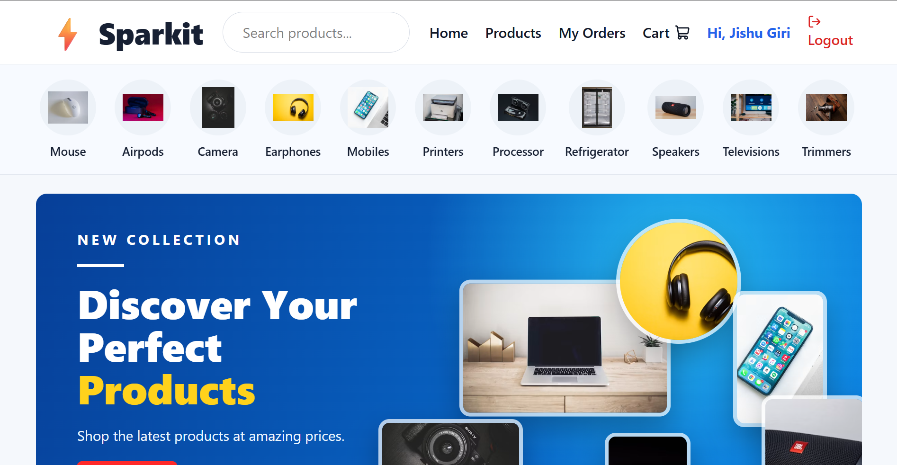

# ⚡ Sparkit E-Commerce

A full-stack MERN e-commerce web application built with React.js, Node.js, Express.js, and MongoDB.

## 🚀 Live Demo

- Frontend: https://sparkit-e-commerce-1.onrender.com
- Backend API: https://sparkit-e-commerce.onrender.com

## 📸 Project Preview



## 📌 Features

- User Registration & Login
- JWT-based Authentication
- Product Listing
- Product Details
- Product Categories
- Search Products
- Shopping Cart
- Checkout
- Cash on Delivery
- Order Placement
- My Orders / Order History
- Order Status
- Responsive Design
- MongoDB Database
- REST API
- Backend deployed on Render
- Frontend deployed on Render

## 🛠️ Tech Stack

### Frontend
- React.js
- React Router
- Axios
- Tailwind CSS
- Lucide React
- Vite

### Backend
- Node.js
- Express.js
- MongoDB
- Mongoose
- JWT
- bcryptjs
- CORS
- dotenv

### Tools
- Git
- GitHub
- VS Code
- Postman
- Render

## 📂 Project Structure

```text
Sparkit-E-Commerce/
│
├── backend/
│   ├── models/
│   ├── routes/
│   ├── db.js
│   ├── server.js
│   └── package.json
│
├── frontend/
│   ├── src/
│   │   ├── pages/
│   │   ├── App.jsx
│   │   └── main.jsx
│   ├── package.json
│   └── vite.config.js
│
├── .gitignore
└── README.md